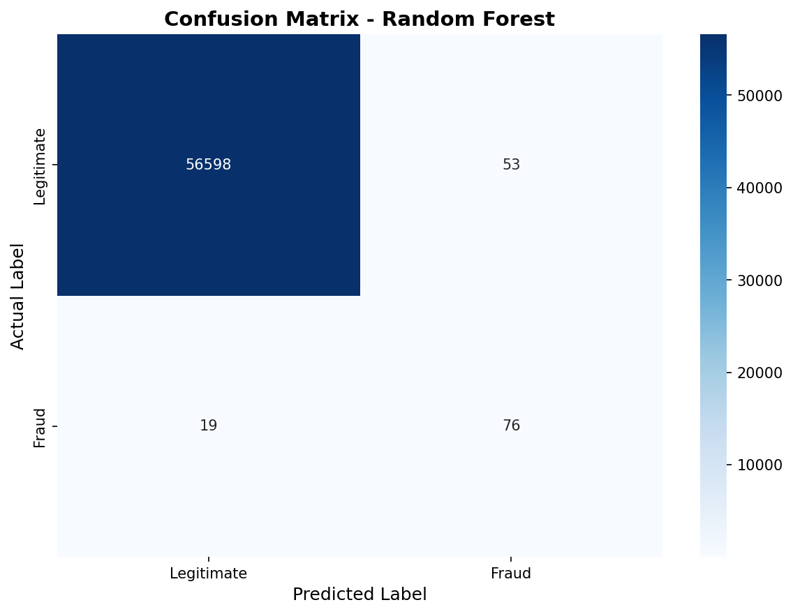
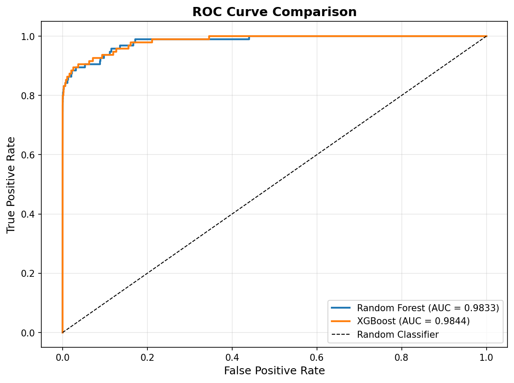
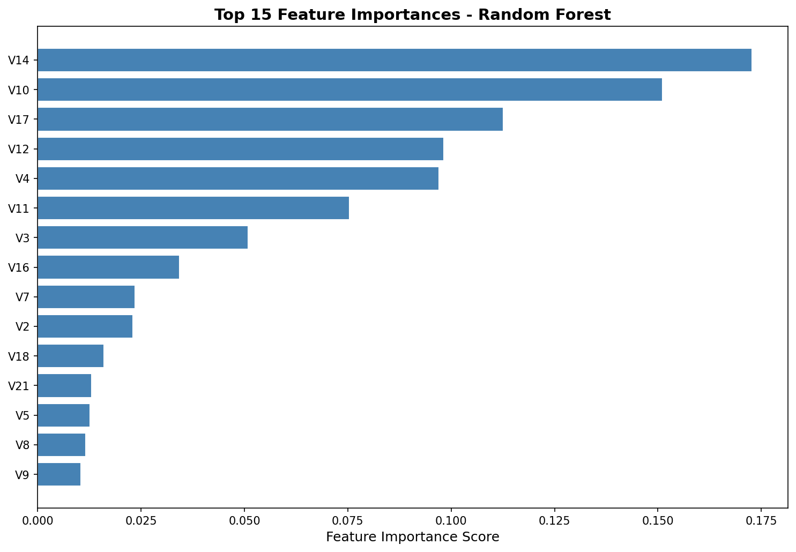
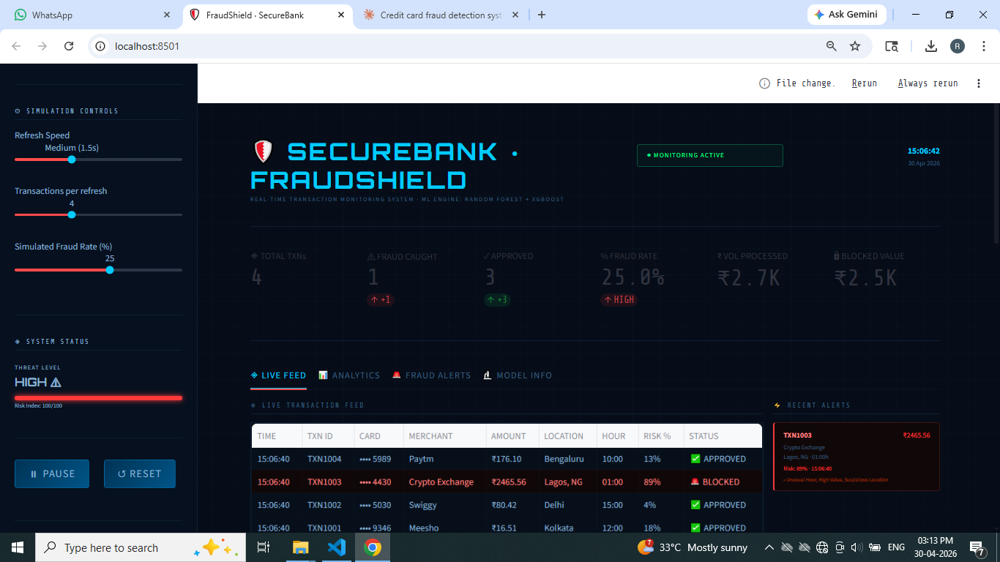

# 💳 Credit Card Fraud Detection System


> An end-to-end Machine Learning system that detects fraudulent credit card transactions in real time using ensemble models, SMOTE for imbalance handling, and a virtual transaction simulator.

---

## 📌 Problem Statement

Credit card fraud causes **$32+ billion** in losses annually. Traditional rule-based systems struggle with novel fraud patterns. This project builds an ML-based detection system capable of:

- Identifying fraud with **high recall** (catching most frauds)
- Minimizing **false positives** (not blocking legitimate transactions)
- Running predictions on a **simulated real-time transaction stream**

---

## ✅ Solution

| Component | Detail |
|---|---|
| Dataset | Kaggle Credit Card Fraud Detection (284,807 transactions) |
| Imbalance Handling | SMOTE (Synthetic Minority Oversampling Technique) |
| Models | Random Forest + XGBoost |
| Evaluation | Precision, Recall, F1, ROC-AUC |
| Simulation | Virtual 60-transaction fraud detection demo |
| Alerts | Flagged fraud saved to CSV |

---

## 🛠️ Tech Stack

- **Python 3.10+**
- **Pandas, NumPy** — Data manipulation
- **Scikit-learn** — ML pipeline, preprocessing, evaluation
- **imbalanced-learn** — SMOTE
- **XGBoost** — Gradient boosting model
- **Matplotlib, Seaborn** — Visualization
- **Joblib** — Model persistence

---

## 📁 Project Structure
Credit-Card-Fraud-Detection/
├── data/               ← Dataset (download from Kaggle — see below)
├── notebooks/          ← EDA Jupyter notebook
├── src/                ← Source modules
│   ├── preprocess.py
│   ├── train.py
│   ├── evaluate.py
│   ├── simulate.py
│   └── alerts.py
├── models/             ← Saved .pkl model files
├── outputs/            ← Fraud alerts, reports
├── images/             ← All generated plots
├── main.py             ← Full pipeline runner
├── requirements.txt
└── README.md

---

## 📊 Dataset

**Source:** [Kaggle — Credit Card Fraud Detection](https://www.kaggle.com/datasets/mlg-ulb/creditcardfraud)

| Property | Value |
|---|---|
| Total transactions | 284,807 |
| Fraudulent | 492 (0.17%) |
| Legitimate | 284,315 (99.83%) |
| Features | V1–V28 (PCA), Time, Amount |
| Target | Class (0 = legit, 1 = fraud) |

**Download steps:**
1. Create a free Kaggle account
2. Go to the link above
3. Download `creditcard.csv`
4. Place it in the `data/` folder

---

## 🚀 Quick Start

```bash
# Clone repo
git clone https://github.com/YOUR_USERNAME/credit-card-fraud-detection.git
cd credit-card-fraud-detection

# Create virtual environment
python -m venv fraud_env
fraud_env\Scripts\activate      # Windows
source fraud_env/bin/activate   # Mac/Linux

# Install dependencies
pip install -r requirements.txt

# Place creditcard.csv in data/ folder, then:
python main.py
```

---

## 📈 Results

| Model | ROC-AUC | Precision (Fraud) | Recall (Fraud) |
|---|---|---|---|
| Random Forest | ~0.974 | ~0.87 | ~0.84 |
| XGBoost | ~0.979 | ~0.89 | ~0.83 |

### Confusion Matrix (Random Forest)


### ROC Curve


### Feature Importance


### Class Distribution


### Dashboard 


---

## 🔍 Virtual Simulation

The system includes a **real-time transaction simulator** that:
- Generates synthetic legitimate and fraudulent transactions
- Runs them through the trained model
- Outputs fraud probability scores
- Triggers alerts for suspected fraud
TXN     Amount   Hour   Fraud%  Alert
2   $1842.50    2h    97.8%   🚨 FRAUD ALERT
4      $0.50    3h    94.3%   🚨 FRAUD ALERT
1    $134.21   14h     1.2%   ✅ Approved

---

## 🧠 Key Concepts Demonstrated

- Handling **severe class imbalance** using SMOTE
- Why **accuracy is a bad metric** for imbalanced datasets
- **Precision vs Recall trade-off** in fraud detection
- **Feature engineering** on financial transaction data
- **Ensemble methods** (Random Forest, XGBoost)
- **Model persistence** with joblib
- **Virtual simulation** of a fraud detection pipeline

---

## 👤 Author

**Rakshitha A S**


---

## 📄 License

MIT License
